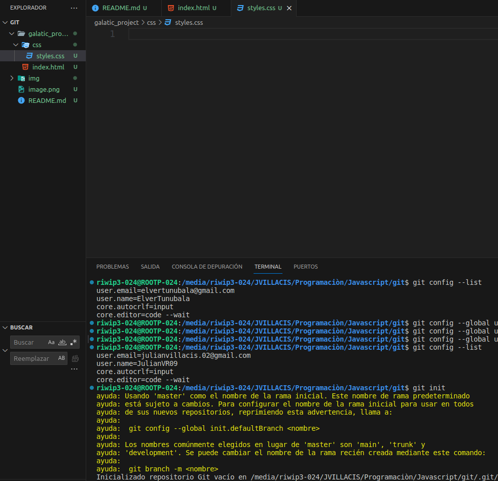

1. ¿Qué es GIT?

A) Un lenguaje de programación.
B) Un sistema de control de versiones distribuido.
C) Un editor de texto.
D) Una red social para desarrolladores.

Mi respuesta: B) Un sistema de control de versiones distribuidos.

2. ¿Cuál es una ventaja de utilizar un sistema de control de versiones distribuido como GIT en comparación con uno centralizado?

A) Requiere más espacio en el servidor.
B) Es más complejo de usar.
C) Permite a los usuarios trabajar de forma independiente y fusionar cambios.
D) Solo el administrador puede hacer cambios.

Mi respuesta: C) Permite a los usuarios trabajar de forma independiente y fusionar cambios.

3. Los 'commits' en GIT se pueden describir mejor como:

A) Versiones del software que están en producción.
B) Fotografías del estado de un proyecto en un momento dado.
C) Ramas nuevas en el repositorio.
D) Mensajes entre colaboradores.

Mi respuesta: B) Fotografías del estado de un proyecto en un momento dado.

4. Seleccione una razón por la que GIT es ampliamente utilizado:

A) Su capacidad para almacenar imágenes de alta resolución.
B) La habilidad de rastrear cambios y colaborar en proyectos.
C) Su integración con redes sociales.
D) La posibilidad de ejecutar código directamente desde el repositorio.

Mi respuesta: B) La habilidad de rastrear cambios y colaborar en proyectos.

5. ¿Qué es un repositorio en GIT?

A) Una colección de documentos.
B) Un espacio de almacenamiento en la nube.
C) Un directorio de trabajo donde se almacenan los archivos del proyecto.
D) Un lugar donde se almacenan y gestionan las versiones de un proyecto.

Mi respuesta: D) Un lugar donde se almacenan y gestionan las versiones de un proyecto.

6. ¿Cuál es la importancia de git en relación con la vieja forma de guardar archivos como 'final_final_este_si.docx'?

A) Permite una mejor organización de las imágenes del proyecto.
B) Facilita la colaboración en documentos de texto.
C) Mejora la gestión de versiones, evitando la confusión de nombres de archivos.
D) Aumenta la velocidad de acceso a los archivos.

Mi respuesta: C) Mejora la gestión de versiones, evitando la confusión de nombres de archivos.

7. Para verificar la versión de GIT instalada en tu sistema, usarías el comando:

A) git --version
B) git version
C) git info
D) git check

Mi respuesta: A) git --version

8. Si deseas configurar tu nombre de usuario y email en GIT de forma local, ¿cuál de los siguientes comandos utilizarías?

A) git config --global user.name "Tu Nombre". git config --global user.email "Tu email".
B) git config --system user.name "Tu Nombre". git config --system user.email "Tu email".
C) git setup --local user.name "Tu Nombre". git config --system user.email "Tu email".
D) git initialize user "Tu Nombre". git config --global user.email "Tu email".

Mi respuesta: A) git config --global user.name "Tu Nombre". git config --global user.email "Tu email".

9. ¿Cuál de los siguientes comandos se utiliza para iniciar un nuevo repositorio GIT?

A) git start
B) git create
C) git init
D) git new

Mi respuesta: C) git init

10. Para agregar cambios al área de preparación (staging area) en GIT, usarías:

A) git add .
B) git commit
C) git save
D) git stage

Mi respuesta: A) git add .

11. ¿Cuál es el propósito principal del workflow en GIT, desde el directorio de trabajo hasta el repositorio local?

A) Permitir el almacenamiento de backups en la nube.
B) Facilitar la edición de código directamente desde el repositorio.
C) Manejar el flujo de cambios a través de diferentes etapas hasta que se consolidan en el repositorio.
D) Configurar automáticamente los permisos de usuario y seguridad.

Mi respuesta: C) Manejar el flujo de cambios a través de diferentes etapas hasta que se consolidan en el repositorio.

12. ¿Qué problema resuelve la normalización de fin de línea (CRLF a LF) en GIT, especialmente en Windows?

A) Previene conflictos en la codificación de caracteres.
B) Mejora la velocidad de las operaciones de GIT.
C) Evita problemas en la comparación y fusión de archivos debido a diferencias en los caracteres de fin de línea entre sistemas operativos.
D) Aumenta la seguridad al transferir archivos entre diferentes sistemas operativos.

Mi respuesta: C) Evita problemas en la comparación y fusión de archivos debido a diferencias en los caracteres de fin de línea entre sistemas operativos.

13. En el contexto de GIT, ¿qué representa una rama?

A) Una copia exacta del repositorio central para cada colaborador.
B) Un cambio directo en el archivo en el repositorio principal.
C) Una versión del repositorio que diverge del flujo principal de trabajo, permitiendo el desarrollo paralelo sin afectar el estado principal.
D) Una herramienta para fusionar automáticamente cambios de diferentes colaboradores.

Mi respuesta: C) Una versión del repositorio que diverge del flujo principal de trabajo, permitiendo el desarrollo paralelo sin afectar el estado principal.

